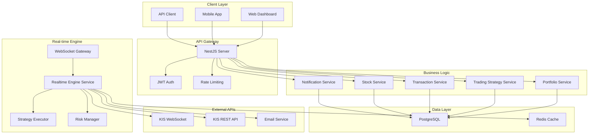

# 🚀 Auto Trade Server

<div align="center">


**실시간 주식 자동매매 시스템을 위한 고성능 백엔드 서버**

[기능](#-주요-기능) • [설치](#-설치-및-실행) • [API 문서](#-api-문서) • [아키텍처](#-시스템-아키텍처)

</div>

---

## 📋 개요

Auto Trade Server는 **실시간 주식 데이터 처리**와 **자동매매 전략 실행**을 위한 고성능 백엔드 시스템입니다. 한국투자증권(KIS) API와 연동하여 실시간 주가 데이터를 수신하고, 사용자 정의 전략에 따라 자동으로 매매를 실행합니다.

### 🎯 핵심 가치
- **실시간 처리**: WebSocket을 통한 실시간 주가 데이터 수신 및 처리
- **전략 기반 자동매매**: RSI, MACD, 이동평균 등 다양한 기술적 지표 기반 자동매매
- **리스크 관리**: 포지션 크기, 일일 거래 한도, 손실 한도 등 종합적인 리스크 관리
- **확장 가능한 아키텍처**: 모듈화된 설계로 쉬운 기능 확장 및 유지보수

---

## ✨ 주요 기능

### 🔐 인증 및 보안
- **JWT 기반 인증** 시스템
- **bcrypt**를 활용한 비밀번호 암호화
- **Rate Limiting** 및 보안 미들웨어
- **CORS** 설정으로 안전한 크로스 오리진 요청

### 📊 실시간 데이터 처리
- **WebSocket**을 통한 실시간 주가 데이터 수신
- **한국투자증권(KIS) API** 연동
- **실시간 기술적 지표** 계산 (RSI, MACD, Bollinger Bands 등)
- **자동매매 신호** 생성 및 실행

### 📈 포트폴리오 관리
- **다중 포트폴리오** 지원
- **실시간 수익률** 계산
- **보유 주식** 추적 및 관리
- **거래 내역** 상세 기록

### 🤖 자동매매 전략
- **이동평균 전략** (SMA, EMA)
- **RSI 기반** 과매수/과매도 신호
- **MACD** 모멘텀 전략
- **볼린저 밴드** 변동성 전략
- **사용자 정의** 전략 지원

### 🛡️ 리스크 관리
- **일일 거래 한도** 설정
- **최대 포지션 크기** 제한
- **거래당 리스크** 관리
- **일일 손실 한도** 설정
- **포트폴리오 집중도** 관리

### 📱 알림 시스템
- **실시간 WebSocket** 알림
- **이메일** 알림 지원
- **가격 알림** 설정
- **거래 실행** 알림

### 📊 모니터링
- **시스템 상태** 모니터링
- **거래 성과** 분석
- **전략 실행** 통계
- **에러 로깅** 및 추적

---

## 🏗️ 시스템 아키텍처



---

## 🛠️ 기술 스택

### Backend Framework
- **NestJS** - Node.js 기반 엔터프라이즈급 프레임워크
- **TypeScript** - 타입 안전성을 위한 정적 타입 언어
- **Express** - 웹 애플리케이션 프레임워크

### Database & ORM
- **PostgreSQL** - 관계형 데이터베이스
- **TypeORM** - 객체 관계 매핑 (ORM)
- **Redis** - 캐싱 및 세션 관리

### Real-time Communication
- **WebSocket** - 실시간 양방향 통신
- **Socket.IO** - WebSocket 라이브러리

### External Integrations
- **한국투자증권(KIS) API** - 주식 데이터 및 거래 실행
- **Nodemailer** - 이메일 알림 서비스

### Development Tools
- **Jest** - 테스팅 프레임워크
- **ESLint** - 코드 품질 관리
- **Prettier** - 코드 포맷팅
- **Swagger** - API 문서화

---

## 📁 프로젝트 구조

```
src/
├── modules/                    # 비즈니스 로직 모듈
│   ├── auth/                  # 인증 및 사용자 관리
│   ├── stocks/                # 주식 데이터 관리
│   ├── portfolios/            # 포트폴리오 관리
│   ├── trading-strategies/    # 자동매매 전략
│   ├── transactions/          # 거래 내역 관리
│   ├── notifications/         # 알림 시스템
│   ├── monitoring/            # 시스템 모니터링
│   └── websocket/             # 실시간 통신
├── entities/                  # 데이터베이스 엔티티
│   ├── user.entity.ts
│   ├── stock.entity.ts
│   ├── portfolio.entity.ts
│   ├── trading-strategy.entity.ts
│   └── transaction.entity.ts
├── infrastructure/            # 인프라스트럭처 레이어
│   ├── database/             # 데이터베이스 설정
│   ├── external/             # 외부 API 연동
│   ├── services/             # 공통 서비스
│   └── config/               # 설정 관리
├── shared/                   # 공통 유틸리티
│   ├── decorators/           # 커스텀 데코레이터
│   ├── guards/               # 인증 가드
│   ├── middleware/           # 미들웨어
│   └── types/                # 공통 타입 정의
└── dtos/                     # 데이터 전송 객체
```

---

## 🚀 설치 및 실행

### 1. 저장소 클론
```bash
git clone https://github.com/your-username/auto-trade-server.git
cd auto-trade-server
```

### 2. 의존성 설치
```bash
npm install
```

### 3. 환경 변수 설정
```bash
cp .env.example .env
```

`.env` 파일을 편집하여 필요한 환경 변수를 설정하세요:

```env
# 데이터베이스 설정
DB_HOST=localhost
DB_PORT=5432
DB_USERNAME=your_username
DB_PASSWORD=your_password
DB_NAME=auto_trade_db

# JWT 설정
JWT_SECRET=your_jwt_secret
JWT_EXPIRES_IN=24h

# KIS API 설정
KIS_APP_KEY=your_kis_app_key
KIS_APP_SECRET=your_kis_app_secret
KIS_DEMO_APP_KEY=your_demo_app_key
KIS_DEMO_APP_SECRET=your_demo_app_secret

# 서버 설정
PORT=9988
NODE_ENV=development

# 이메일 설정
SMTP_HOST=smtp.gmail.com
SMTP_PORT=587
SMTP_USER=your_email@gmail.com
SMTP_PASS=your_app_password
```

### 4. 데이터베이스 설정
```bash
# PostgreSQL 데이터베이스 생성
createdb auto_trade_db

# 데이터베이스 마이그레이션 실행
npm run migration:run
```

### 5. 애플리케이션 실행
```bash
# 개발 모드
npm run start:dev

# 프로덕션 모드
npm run build
npm run start:prod
```

### 6. API 문서 확인
브라우저에서 `http://localhost:9988/api`로 접속하여 Swagger API 문서를 확인할 수 있습니다.

---

## 📚 API 문서

### 인증 API
- `POST /auth/register` - 사용자 회원가입
- `POST /auth/login` - 사용자 로그인
- `POST /auth/refresh` - 토큰 갱신
- `POST /auth/logout` - 로그아웃

### 주식 데이터 API
- `GET /stocks` - 주식 목록 조회
- `GET /stocks/:id` - 특정 주식 정보 조회
- `GET /stocks/:id/history` - 주식 가격 히스토리

### 포트폴리오 API
- `GET /portfolios` - 포트폴리오 목록
- `POST /portfolios` - 포트폴리오 생성
- `GET /portfolios/:id` - 포트폴리오 상세 정보
- `PUT /portfolios/:id` - 포트폴리오 수정
- `DELETE /portfolios/:id` - 포트폴리오 삭제

### 자동매매 전략 API
- `GET /trading-strategies` - 전략 목록
- `POST /trading-strategies` - 전략 생성
- `PUT /trading-strategies/:id` - 전략 수정
- `DELETE /trading-strategies/:id` - 전략 삭제
- `POST /trading-strategies/:id/activate` - 전략 활성화
- `POST /trading-strategies/:id/deactivate` - 전략 비활성화

### 거래 내역 API
- `GET /transactions` - 거래 내역 조회
- `GET /transactions/:id` - 특정 거래 상세 정보
- `GET /transactions/portfolio/:portfolioId` - 포트폴리오별 거래 내역

---

## 🔧 개발 가이드

### 코드 스타일
- **ESLint**와 **Prettier**를 사용한 일관된 코드 스타일
- **TypeScript** 엄격 모드 사용
- **NestJS** 컨벤션 준수

### 테스트
```bash
# 단위 테스트
npm run test

# E2E 테스트
npm run test:e2e

# 테스트 커버리지
npm run test:cov
```

### 데이터베이스 마이그레이션
```bash
# 마이그레이션 생성
npm run migration:generate -- -n MigrationName

# 마이그레이션 실행
npm run migration:run

# 마이그레이션 되돌리기
npm run migration:revert
```

---

## 🚨 주의사항

### ⚠️ 투자 위험 고지
- 이 시스템은 **교육 및 연구 목적**으로 제작되었습니다
- **실제 투자에 사용할 경우 손실 위험**이 있습니다
- 투자 결정은 **본인의 책임**하에 이루어져야 합니다

### 🔒 보안 고려사항
- **API 키**는 절대 공개하지 마세요
- **프로덕션 환경**에서는 강력한 비밀번호를 사용하세요
- **정기적인 보안 업데이트**를 수행하세요

---

## 🤝 기여하기

1. Fork the Project
2. Create your Feature Branch (`git checkout -b feature/AmazingFeature`)
3. Commit your Changes (`git commit -m 'Add some AmazingFeature'`)
4. Push to the Branch (`git push origin feature/AmazingFeature`)
5. Open a Pull Request

---

## 📄 라이선스

이 프로젝트는 MIT 라이선스 하에 배포됩니다. 자세한 내용은 `LICENSE` 파일을 참조하세요.

---

## 📞 문의

프로젝트에 대한 문의사항이 있으시면 이슈를 생성해 주세요.

---

<div align="center">

**⭐ 이 프로젝트가 도움이 되었다면 Star를 눌러주세요! ⭐**

Made with ❤️ by [Your Name]

</div>